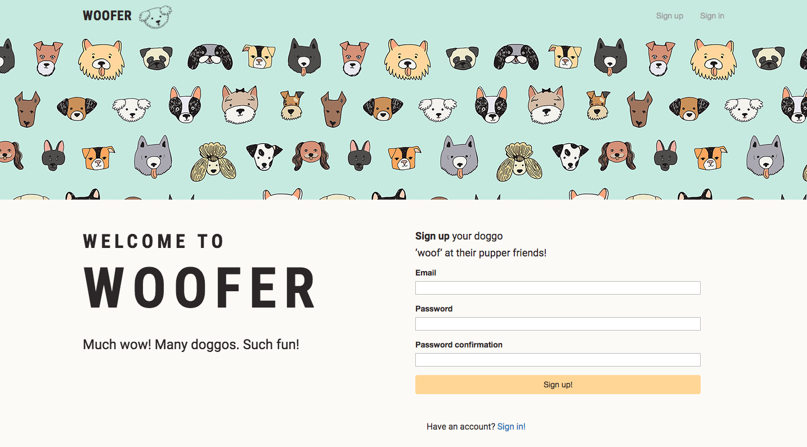
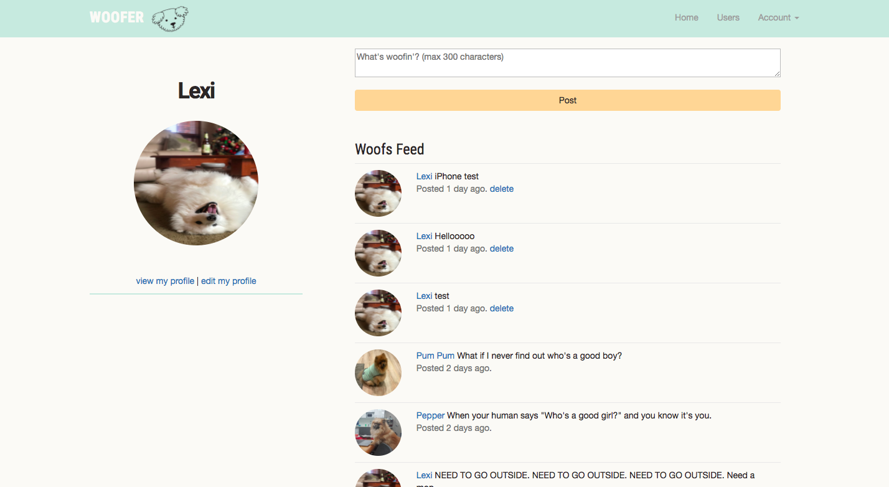
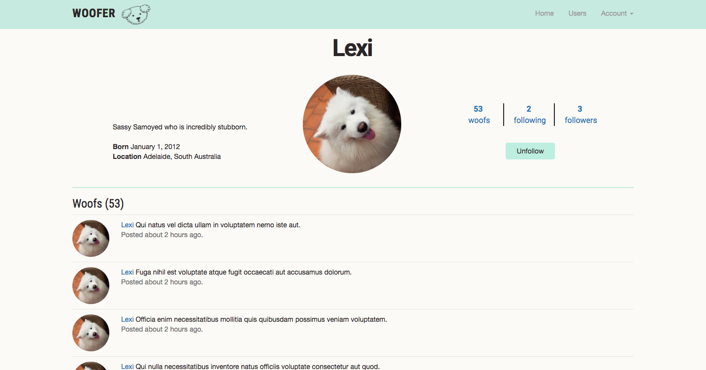
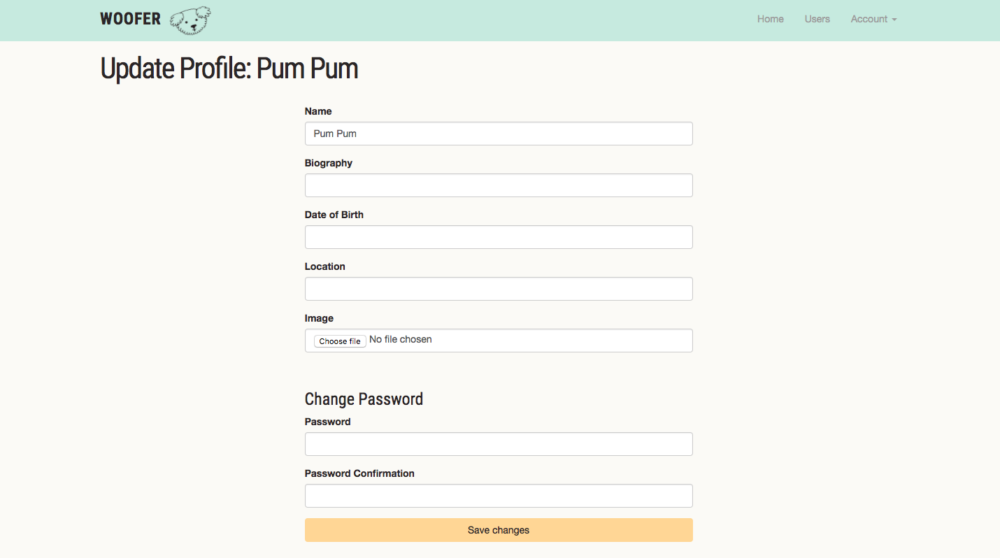
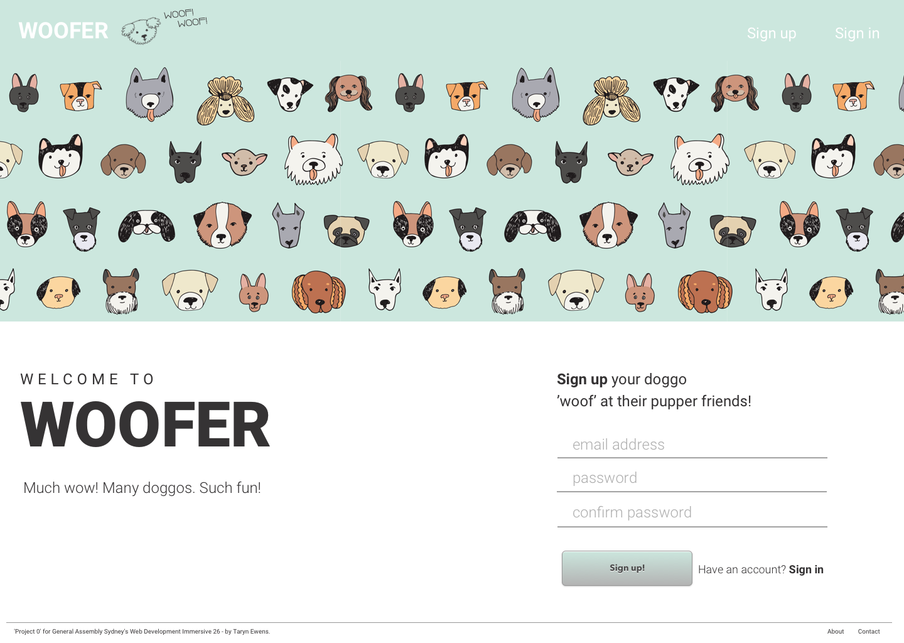
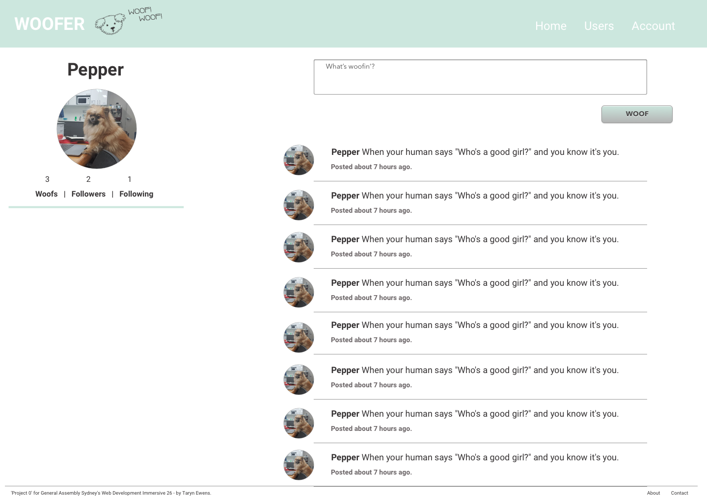
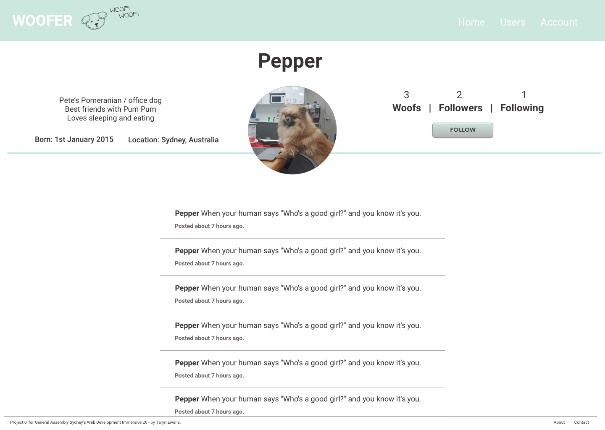

# Project 1 - WOOFER (It's like Twitter... for dogs!)

See it in action here: https://wooferproject.herokuapp.com/

It is a social media platform (basically a Twitter clone) but for users to sign up on behalf of their dogs and "woof" (instead of "tweet") at their dog friends!



## How to use
- Sign up on the home page, update your doggos details, then you're ready to 'woof'!
- Post your woofs from the home page



- Find other doggos to follow on the users page
- View a doggos profile and click 'follow' to add their woofs to your home feed!



- Unfollow if you need, delete embarrassing past tweets, and edit or delete your account at any time (Much disappoint. Many sad.)



## Objectives
- App should have at least 3 models. Currently Users, Woofs & Relationships.
- Views. Use partials to DRY (Don’t Repeat Yourself) up your views.
- Handles invalid data. Forms in your application should validate data and handle incorrect inputs.
- Validate sign up information, verify valid email addresses and secure passwords.
- Use Gems Use a GEM that talks to an API to add functionality to your app. Currently "Cloudinary".
- User Login. Make sure you have basic authentication and authorization set up (if you need it).
- Heroku. Deploy your code to Heroku.

## Built With
- HTML
- CSS (Sass)
- Ruby on Rails
- Bootstrap

## Scope
WOOFER - Twitter for Dogs - Woof at your doggo friends!
Features will include
- Sign up
- Sign in via email address
- Set up profile with photo (uploaded via Cloudinary), name, bio etc.
- View own profile, and other dogs profile
- Follow and unfollow other dogs
- Post 'woofs' - images as well as text if possible.
- Home feed of 'woofs' from dogs they follow
- Edit or delete profile
- If time permits create a likes model, which would allow users to like 'woofs'.

## Object models
- USER (dogs) has_many WOOFS
- WOOFS belongs_to DOG
- RELATIONSHIPS belongs_to :follower_id and belongs_to :followed_id

If time permits
- LIKES belongs_to :liker_id and belongs_to :liked_id

## Wireframes
Built in Sketch.







## Approach
After deciding on my scope and object models, setting up the Users and Woofs were pretty straight forward. Things became challenging when it came to the Relationships, but thankfully the Ruby on Rails tutorial existed and helped me through the process. (https://www.railstutorial.org/book/following_users)

The relationships were quite difficult to get my head around. Unlike the Users having many Woofs, and the Woofs belonging to a User, the relationships were set up completely different.

The database table for Relationships contains:

```
create_table "relationships", force: :cascade do |t|
  t.integer "follower_id"
  t.integer "followed_id"
  t.datetime "created_at", null: false
  t.datetime "updated_at", null: false
  t.index ["followed_id"], name: "index_relationships_on_followed_id"
  t.index ["follower_id", "followed_id"], name: "index_relationships_on_follower_id_and_followed_id", unique: true
  t.index ["follower_id"], name: "index_relationships_on_follower_id"
end
```

It's model states that a relationship belongs to a "follower" and also belongs to a "followed".

Within this relationship their are active relationships (when a user has actively followed someone) and passive relationships (when someone has followed the user).

The relationships controller contains the following:

```
class RelationshipsController < ApplicationController
  def create
    user = User.find(params[:followed_id])
    @current_user.follow(user)
    redirect_to user
  end
  def destroy
    user = Relationship.find(params[:id]).followed
    @current_user.unfollow(user)
    redirect_to user
  end
end
```

This was definitely a hard one to understand, particularly with how the followers and following gets displayed on the show_follow page.


I decided to challenge myself by using Bootstrap which I'd never used before, but quickly came to realise that while Bootstrap is amazing to get the front end up and running - when it comes to the level of customisation I was trying to do, it became quite challenging!

In terms of design, I put together some wireframes (seen above) before I touched any CSS and based the design partly on the Bootstrap set up. I decided on the graphic I would use on the home page, and pulled colours from that to create the colour scheme used throughout the site.

Looking back, I probably wouldn't have used Bootstrap had I known the challenge it would have been. I had to spend a lot of time on the CSS and working on getting the website to be responsive. There are still some minor issues (such as the navigation covering the content on mobile devices) which I will need to fix.


My next challenge was implementing the Cloudinary media management platform to enable users to upload photos. I had previously implemented some User helpers which told the browser to display the users image if it exists, else display a default image. This caused problems when adding Cloudinary and resulted in me having to remove the helpers.

Cloudinary was still incredibly challenging and it took a couple of days to get it working. I had intended to allow users to upload images with their "woofs", but after the 2 days it took to get their profile images working, I had to postpone that feature. I was very grateful to Winnie and Monique in my class who worked through the Cloudinary with me - I think I would have spent a whole extra day on it without them!

There are still some features I didn't get time to implement, and some features (see bugs) that I would like to change.

Currently, there is a really cool "feature" where every time you edit your profile you have to update your photo. Just to keep the puppers photos fresh and relevant! So hip.


## To do:
- [ ] Give dogs a default name when they sign up (Doge)
- [ ] Rebuild navigation to fix issues on mobile devices
- [ ] Add likes model (similarly set up to Relationships) to allow users to like "woofs"
- [ ] Allow users to upload images with their "woofs"
- [ ] Add javascript to make logo animated
- [ ] Notifications (this might be a huge call)


## License
This project is licensed under the MIT license.

## Acknowledgments
As usual, thanks to Joel, John and Theo @ General Assembly for the help, as well as Winnie and Monique for spending their own project time working with me on Cloudinary which was a killer! Girls supporting girls at its finest!

This project was undertaken as part of the General Assembly Sydney's WDI 26 course, April 2018.
